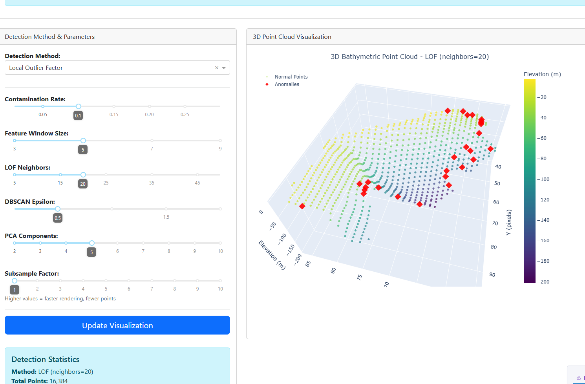

A series of classical anomaly detection algorithms tailored for BAG files used in NOAA OCS.

## Installation
```
$ conda env create -f environment.yml
$ conda activate anomaly
```

## Usage
**Dashboard**

Run the script and open the dashboard in a browser (http://127.0.0.1:8050).
```
$ python anomaly.py --dashboard
```


**CLI**

Example: Process the input bag file using Local Outlier Factor (LOF) method and return the outliers in a geotiff file.
```
$ python anomaly.py E01001_MB_VR_MLLW_2of5.bag --method lof --output results.tiff
```


